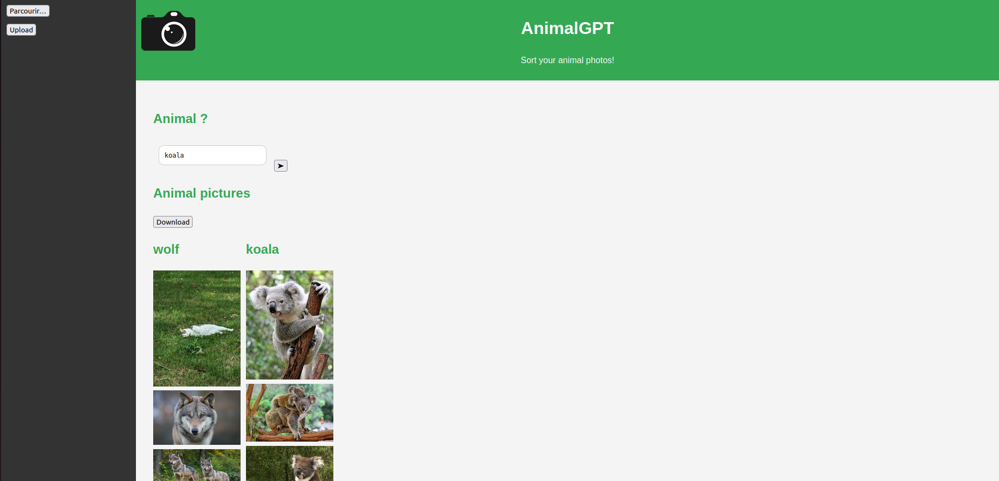

# AnimalGPT

AnimalGPT is an application based on privateGPT that allows you to sort your photos according to an animal and give it a short description.



## Getting started

1. F1 and you will need to enter the details provided to you.
2. At first you will be prompted to enter your user id which should be in the form: ```ssh <host name>@vs-c2.cs.uit.no```
3. Now you can clone this repository into your folder using ```git clone https://github.com/YatoWatch/AnimalGPT.git```
4. Change directory into "AnimalGPT" using ```cd AnimalGPT```
5. Build image ```docker build -t animalgpt .```
6. Enter the following code in the bash terminal: ```docker run --gpus all --ipc=host --ulimit memlock=-1 --ulimit stack=67108864 -it -p 5000:5000/tcp animalgpt```
7. Wait and run server: ```python app.py```

## Sources:

* https://github.com/NirwanUiT/privateGPTpp/tree/main
* https://huggingface.co/timm/resnet18.a1_in1k
